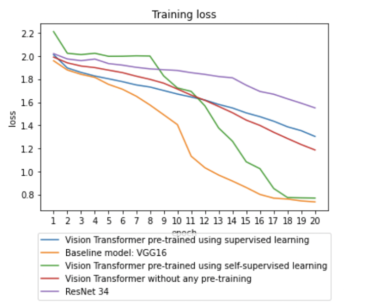

### Problem Statement 
Vision Transformers on a sample of Chest Xray Dataset

In this project, we evaluate Vision Transformers performance on Chest Xray Dataset. For our baseline, we use DCNN networks such as VGG16, and RESNET 34, which were pretrained on ImageNet. The project files can be found at - https://github.com/aish1795/CV-project

We use Vision Transformers in three different setups
1. Vision Transformers pretrained on ImageNet
2. Vision Transformeres pretrained using Supervised Learning
3. Vision Transforrmers without any pretraining

| Model   | Validation Accuracy | Testing Accuracy |
| --------| --------------------|------------------|
| VGG16   | 45%                 | 43%              |
| Resnet  | 45%                 | 46.2%            |
| Vision Transformer Pretrained on ImageNet | 45.3%     | 44.2%     |
| Vision Transformer Pretrained using Supervised Learning | 46.5%     | 48.7%  |
| Vision Transformer Without Pretraining | 45.33%   | 43.33%|
